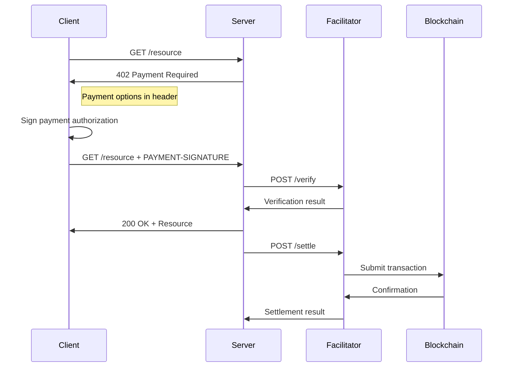

# Core Concepts

Understanding the key concepts behind T402.

## Payment Flow

T402 follows a simple HTTP-based payment flow:



## Key Terms

### Resource Server
The HTTP server that provides a resource (API, content, file) that requires payment.

### Client
The entity making HTTP requests and paying for resources.

### Facilitator
A server that handles payment verification and settlement. Can be self-hosted or use a hosted service.

### Scheme
A logical way of moving money. T402 supports multiple schemes:
- **exact**: Pay an exact amount (EIP-3009 for EVM, SPL for Solana)
- **exact-legacy**: Legacy token transfers (USDT on Ethereum)

### Network
The blockchain network where payment occurs:
- `eip155:1` - Ethereum Mainnet
- `eip155:8453` - Base
- `eip155:42161` - Arbitrum
- `ton:mainnet` - TON
- `tron:mainnet` - TRON
- `solana:mainnet` - Solana

## Payment Headers

### Request Headers

| Header | Description |
|--------|-------------|
| `PAYMENT-SIGNATURE` | Base64-encoded payment payload |

### Response Headers

| Header | Description |
|--------|-------------|
| `PAYMENT-REQUIRED` | Base64-encoded payment requirements (402 response) |
| `PAYMENT-RESPONSE` | Base64-encoded settlement result (200 response) |

## Payment Requirements

When a server responds with 402, it includes payment requirements:

```typescript
interface PaymentRequirements {
  scheme: 'exact' | 'exact-legacy'
  network: string           // e.g., 'eip155:8453'
  maxAmountRequired: string // e.g., '1000000' (1 USDT)
  resource: string          // Resource identifier
  description?: string      // Human-readable description
  mimeType?: string         // Expected response type
  payTo: string             // Recipient address
  maxTimeoutSeconds?: number
  asset?: string            // Token address
  extra?: Record<string, unknown>
}
```

## Payment Payload

The client creates a payment payload based on the requirements:

```typescript
interface PaymentPayload {
  t402Version: number
  scheme: string
  network: string
  payload: {
    // Scheme-specific payload
    // For EVM: signature, authorization data
    // For TON: signed BOC
    // For TRON: signed transaction
  }
}
```

## Token Support

### USDT0 (Recommended)
The new OFT (Omnichain Fungible Token) version of USDT with:
- EIP-3009 support for gasless transfers
- LayerZero bridging between chains
- Available on Ethereum, Arbitrum, Base, Ink, Berachain, Unichain

### USDT (Legacy)
Traditional USDT on various chains:
- Ethereum (ERC-20)
- TRON (TRC-20)
- Polygon, BNB Chain

### USDC
Also supported on EVM chains with EIP-3009.

## Security Model

T402 is designed to be **trust-minimizing**:

1. **Client signatures**: Payments require client authorization
2. **Amount limits**: Clients specify maximum amounts
3. **Time limits**: Authorizations expire
4. **Nonce tracking**: Prevents replay attacks
5. **No custody**: Facilitators never hold funds

The facilitator can only move funds **exactly as authorized** by the client.
